# Proxmox Backup Server

## 1. Setup OS

a. Cài trên 1 server từ file ISO  
<https://www.proxmox.com/en/downloads>

b. Cài trên Proxmox VE server

Thêm dòng sau vào file `/etc/apt/sources.list`:

```
deb http://download.proxmox.com/debian/pbs bullseye pbs-no-subscription
```

Cài đặt:

```
apt update
apt install proxmox-backup-server
```

Sau khi cài đặt có thể truy cập bằng trình duyệt:  
`https://<IP>:8007`

---

## 2. Tạo User

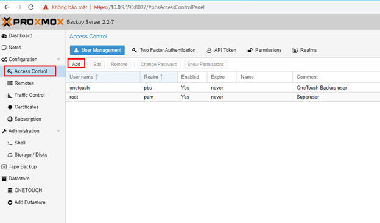

Nhập User/Pass  
Tích **Enabled** và set **Expire never**

---

## 3. Tạo Datastore

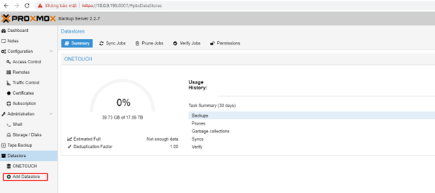  
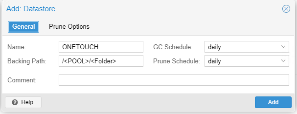  
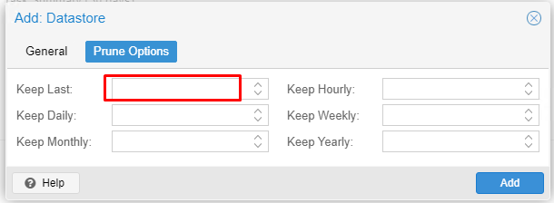

Nhập số bản backup gần nhất cần giữ.  
Set permission cho User nào được sử dụng Datastore này

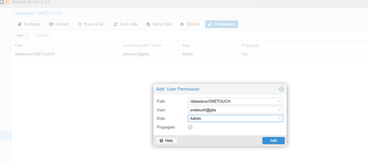

---

## 4. Kết nối đến PVE server

Cấu hình network thông từ PVE server và PBS.  

Trên PBS chạy lệnh:

```
proxmox-backup-manager cert info | grep Fingerprint
```


Lưu thông tin **Fingerprint** để add vào PVE.  

Vào **Cluster PVE**:

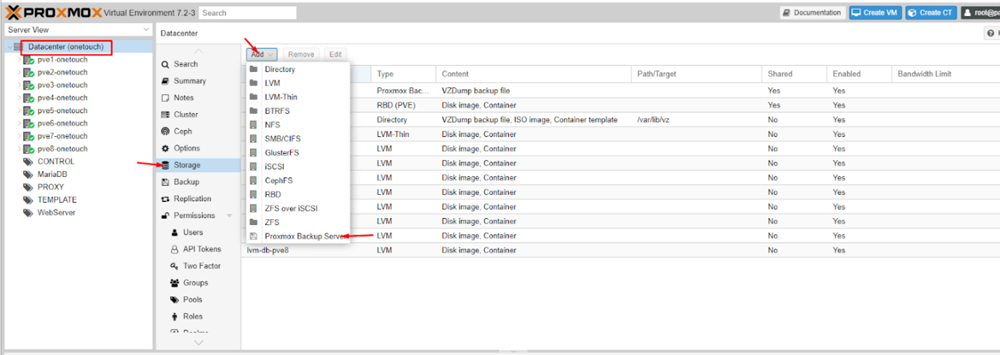  
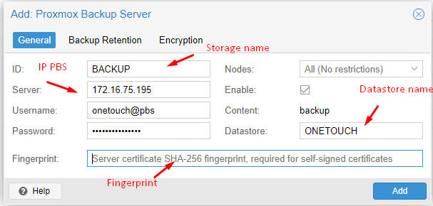  
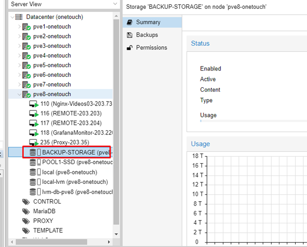  
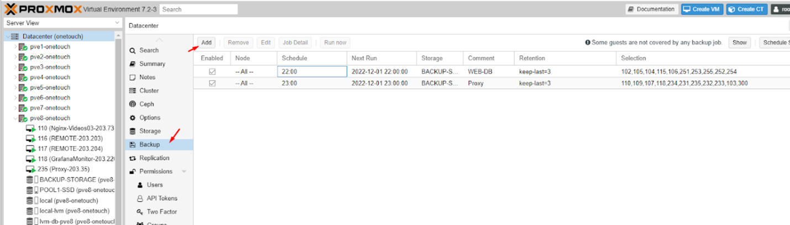

---

## 5. Add Backup Job

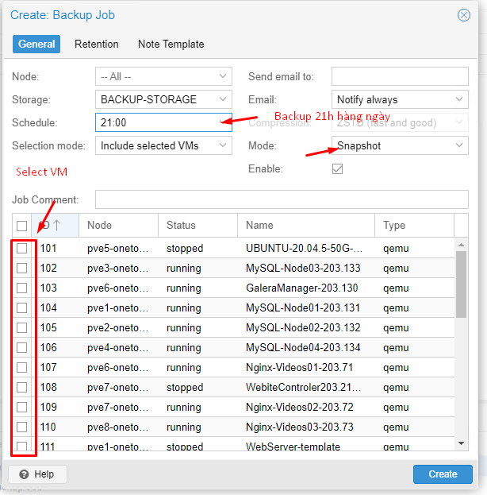  
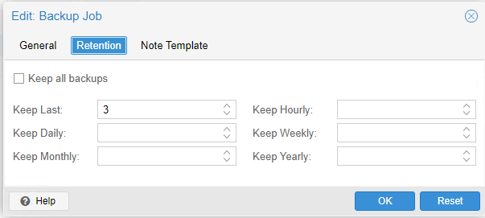
