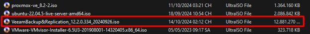

# Hướng dẫn cấu hình Veeam Backup cho Server vật lý

## 1. Cài đặt Veeam Backup Server

Bước 1: Tải phần mềm
Download file ISO `VeeamBackup&Replication_12.2.0.334_20240926.iso` từ trang chủ Veeam.

Bước 2: Cài đặt
Giải nén file ISO và chạy `Setup.exe`

Chọn **Install Veeam Backup & Replication**  
Tiếp tục nhấn **Next** cho tới bước chọn tài khoản.

Bước 3: Thiết lập tài khoản dịch vụ
Dùng **Local System account** hoặc nhập tài khoản domain.

Bước 4: Kết nối SQL Server
- Nếu có SQL Server riêng → nhập thông tin kết nối.  
- Nếu không, Veeam sẽ tự cài SQL Express.

  

Bước 5: Hoàn tất cài đặt
Nhấn **Install** để bắt đầu.  

Chọn **Finish** sau khi hoàn tất.  

Khởi động ứng dụng và nhấn **Connect**.

---

## 2. Cấu hình Backup Repository

Vào **Backup Infrastructure** → **Add Backup Repository**  
Chọn loại repo: Windows, Linux, NAS…  
Chỉ định đường dẫn lưu trữ (ví dụ: `D:\VeeamBackup`) và xác nhận.

---

## 3. Tạo Job Backup cho Server

Vào **Home** → **Jobs** → **Backup Job**  
Chọn **Windows Computer** → đặt tên job.

- Thêm server vật lý cần sao lưu.  
- Chọn chế độ backup: Entire machine / Volume / File-level.  
- Cấu hình lịch chạy job (daily, weekly…).  
- Chọn Repository đã tạo.  
- Xác nhận và chạy thử lần đầu.

---

## 4. Phục hồi Server (Restore)

Vào **Home** → **Restore**  
Chọn kiểu phục hồi:  
- Entire machine  
- Volume  
- File/folder  

Làm theo wizard để chọn thời điểm phục hồi và đích đến.

---

## 5. Lưu ý bảo mật

- Phân quyền người dùng truy cập Veeam rõ ràng.  
- Đặt mật khẩu cho backup repository (nếu dùng NAS).  
- Luôn backup Veeam configuration định kỳ.

---

## 6. Kiểm tra sau triển khai

- Job backup hoàn tất không lỗi.  
- Có thể khôi phục file bất kỳ từ bản backup.  
- Kiểm tra dung lượng backup và retention phù hợp.
