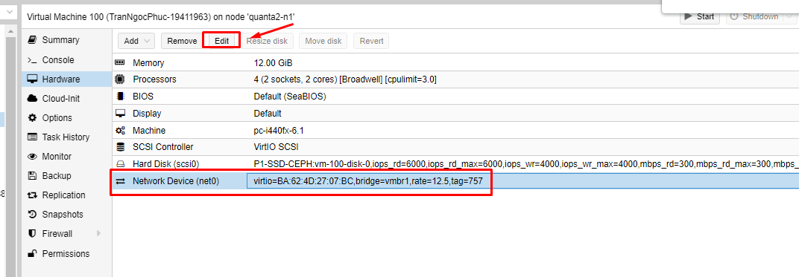

# Proxmox Backup Server

## 1. Setup OS

a. Cai tren 1 server tu file ISO  
<https://www.proxmox.com/en/downloads>

b. Cai tren Proxmox VE server

Them dong sau vao file `/etc/apt/sources.list`:

```
deb http://download.proxmox.com/debian/pbs bullseye pbs-no-subscription
```

Cai dat:

```
apt update
apt install proxmox-backup-server
```

Sau khi cai dat co the truy cap bang trinh duyet:  
`https://<IP>:8007`

---

## 2. Tao User


Nhap User/Pass  
Tich **Enabled** va set **Expire never**

---

## 3. Tao Datastore

  
  


Nhap so ban backup gan nhat can giu.  
Set permission cho User nao duoc su dung Datastore nay


---

## 4. Ket noi den PVE server

Cau hinh network thong tu PVE server va PBS.  

Tren PBS chay lenh:

```
proxmox-backup-manager cert info | grep Fingerprint
```


Luu thong tin **Fingerprint** de add vao PVE.  

Vao **Cluster PVE**:

  
  
  


---

## 5. Add Backup Job

  

