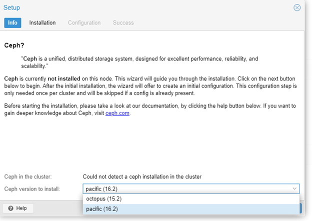
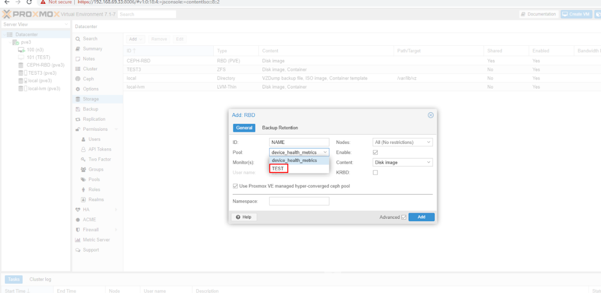

# Ceph Storage

## 1. Cài Ceph package cho OS

  


Chỉ cài đặt các packages, không cần configure thêm.

Copy `ceph.client.admin.keyring`, `ceph.conf` của cluster Ceph qua node Proxmox:

```bash
mkdir /etc/pve/priv/ceph
```

- `ceph.conf` → `/etc/pve/`  
- `ceph.client.admin.keyring` → `/etc/pve/priv/`

---

## 2. Tạo RBD storage


