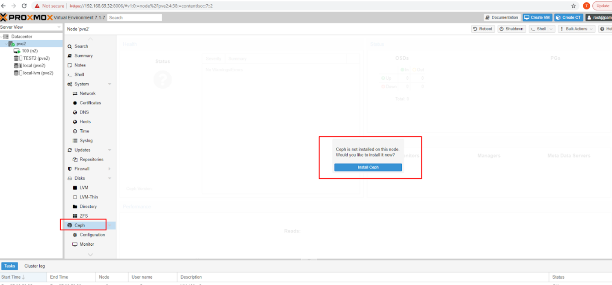

1 . Cài Ceph package cho OS

Chỉ cài đặt các packages ko cần configure thêm

Copy ceph.client.admin.keyring, ceph.conf của cluster Ceph qua node
Proxmox

mkdir /etc/pve/priv/ceph

ceph.conf -\> /etc/pve/

ceph.client.admin.keyring -\> mkdir /etc/pve/priv/

Tạo RBD storage

