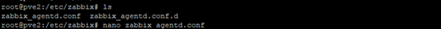
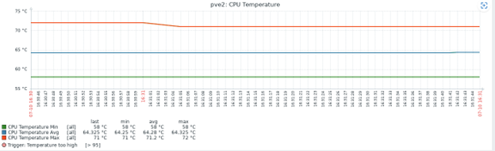

# Hướng dẫn cài Zabbix Agent trên Proxmox

## 1. Cài đặt Zabbix Agent

Cài sẵn Proxmox trên node.  

Bắt đầu bằng cách cập nhật danh sách gói trên máy chủ từ xa:

```bash
sudo apt update
```

Sau đó tải xuống tệp Debian của kho lưu trữ Zabbix:

```bash
wget https://repo.zabbix.com/zabbix/5.0/ubuntu/pool/main/z/zabbix-release/zabbix-release_5.0-1+focal_all.deb
```

Kích hoạt nó bằng lệnh dpkg:

```bash
sudo dpkg -i zabbix-release_5.0-1+focal_all.deb
```


Khi đã có kho lưu trữ, hãy cài đặt tác nhân Zabbix:

```bash
sudo apt install zabbix-agent
```


Khi quá trình cài đặt hoàn tất, hãy kiểm tra daemon:

```bash
sudo systemctl status zabbix-agent
```


Chỉnh sửa file cấu hình `/etc/zabbix/zabbix_agentd.conf`:

```bash
sudo vim /etc/zabbix/zabbix_agentd.conf
```

  


Lưu thay đổi và restart dịch vụ:

```bash
sudo systemctl restart zabbix-agent
```

### Cài tool lm-sensors

```bash
sudo apt install lm-sensors
```

  
  


---

## 2. Add host Zabbix server

Truy cập địa chỉ IP Zabbix server với tài khoản `Admin/zabbix`.

  
  


---

## 3. Check nhiệt độ CPU

Tạo file `userparameter_cputemp.conf` tại `/etc/zabbix/zabbix_agentd.d/`:

```bash
sudo vim /etc/zabbix/zabbix_agentd.d/userparameter_cputemp.conf
```

Thêm nội dung sau:

```bash
UserParameter=basicCPUTemp.min,sensors | grep Core | awk -F'[:+°]' '{if(min==""){min=$3}; if($3<min) {min=$3};} END {print min}'
UserParameter=basicCPUTemp.max,sensors | grep Core | awk -F'[:+°]' '{if(max==""){max=$3}; if(max<$3) {max=$3};} END {print max}'
UserParameter=basicCPUTemp.avg,sensors | grep Core | awk -F'[:+°]' '{avg+=$3}END{print avg/NR}'
```

Restart agent:

```bash
sudo systemctl restart zabbix-agent
```

  

