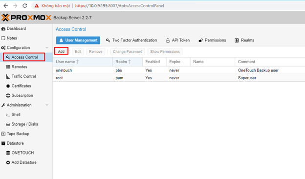

1\. Hướng Dẫn Cài Đặt Proxmox VE:

Chọn Install Proxmox VE

Chọn disk boot

2\. Hướng dẫn cấu hình network trên Proxmox VE

**Cấu hình cơ bản sử dụng Bridge**

Bridge sẽ tạo ra một card mạng vmbr0 kết nối với card enp94s0f0np0 được
cấu hình trên: /etc/network/interfaces

Trên giao diện web của Proxmox vào phần network

**Cấu hình sử dụng Linux Bond:**

Khi bạn có nhiều NIC trên máy chủ, Bond sẽ gộp các NIC này lại để tăng
tốc độ xử lý cũng như khả năng chịu lỗi.

Cấu hình sử dụng OVS Bond:

Để cấu hình sử dụng OVS bond cần cài gói openvswitch-switch

*root@pve-1:~# apt install openvswitch-switch*

3\. Join Cluster cho 3 node Proxmox

Trước tiên cần tạo vlan riêng cho 1 số đường để tránh bị nghẽn

vlan70 dùng cho MGT - vlan71 dùng cho Cluster - vlan72 dùng cho Ceph

Trước khi join cluster phải đảm bảo network giữa các vlan đã thông

Vào phần Datacenter - Cluster - Create Cluster

Cluster name: LVS

Cluster Network chọn vlan71

Sau khi tạo xong cluster sẽ hiển thị phần **Join Information** copy toàn
bộ

Ở node 2 click  **Join Cluster** dán đoạn vừa copy vào phần Cluster
Network chọn vlan71 và điền pass của Proxmox

4\. CEPH STORAGE

Chọn vlan72 cho Ceph

Tạo Ceph OSD

Tạo Ceph OSD cho 10 node vào "Ceph - OSD - Create: OSD"

Tạo xong OSD cho 10 node sẽ hiển thị như trên hình

Tạo Pool cho 10 OSD vừa tạo "Ceph - Pools - Create"

Mặc định ở đây sẽ là Size 3 - Min 2

Sau khi tạo xong sẽ có 1 Storage mới là HDD-STORAGE

Tạo VM trên Proxmox

